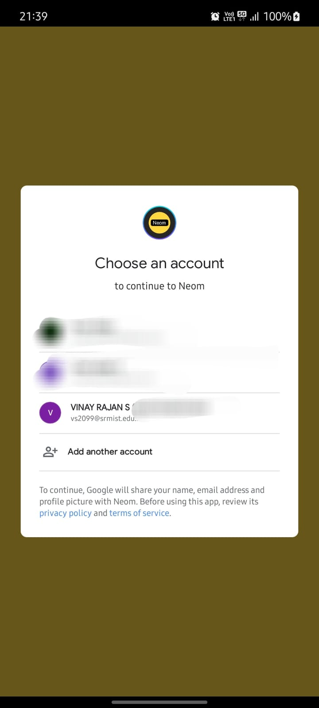

# Neom

Firebase Authentication in Flutter.

<<<<<<< HEAD

=======

>>>>>>> 44b2fa63c91deef25ddcf4cd5beda4f31bed5ab4

# GDSC Tasks

## APP

- [Neom](https://github.com/vinay-04/Neom)
- [SpaceTonic](https://github.com/vinay-04/bmicalculator)

## Backend

- [Store My Files](https://github.com/vinay-04/StoreMyFiles)
- [Pet Store API](https://github.com/vinay-04/Pet-Store-API)
